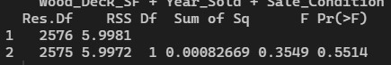

```{r include=FALSE}
source("./scripts/script.R")
source("./scripts/figure_generator.R")
```

# Research Question

-   Primary \| Description

-   Secondary \| Prediction

## Primary \| Description

-   Identify the most important **common fixed, characteristics** of a property in a **multiple regression model** in estimating the housing prices in Ames, Iowa.

-   What improvements can be suggested to increase residential property values ?

## Secondary \| Prediction

Predict the **sale price** of a residential house sale in Ames, Iowa, based on **common fixed, characteristics** of the property.

# Ames Housing Dataset {.build}

-   Sales of individual residential properties in Ames, Iowa from 2006 to 2010.

-   By Sean De Cock (2011), Truman University

-   Well-known for retrospective research in Economics

-   Usually used for Regression - Hedonic Regression

-   A modern alternative to Boston Housing Dataset and California Housing Dataset

## Data Structure

-   `Ames Housing`

-   2930 - 168 = 2762 observations

-   81 features: 23 nominal categorical, 23 ordinal categorical, 15 discrete numeric, and 20 continuous numeric.

-   Response: `Sale_Price`

## 

```{r, echo=FALSE}
property_type_summary %>% kable(caption = "","simple")
```

# Exploratory Data Analysis \| Part 1

-   Missingness

-   Response

## Missingness

```{r missingness, echo=FALSE}
ames_original %>% plot_missing(ggtheme = theme_tq())
```

## Summary Statistics \| Response

```{r message=FALSE, echo=FALSE}
stack_plot_response
```

## 

| Statistics     | Values      |
|----------------|-------------|
| Mean           | \$179,957.7 |
| Median         | \$159,000   |
| Standard Error | 80,219      |

: Sale_Price Statistics

## Transformation on the Response

```{r echo=FALSE}
stack_plot_transformed_response
```

## Update Data Structure

```{r echo=FALSE}
summary(skim(ames1))
```

# Exploratory Data Analysis \| Part 2

-   Distribution of Numericals

-   Correlation Check

-   VIF

## Distribution of Numeric Features

```{r message=FALSE, echo=FALSE}
numeric_plot
```

## 

```{r echo=FALSE}
zero_numeric
```

Remove 10 numeric predictors

## Correlation Check \| Numeric Predictors

```{r numeric-correlation, echo=FALSE, warning=FALSE}
ggplotly(gz, tooltip="text")
```

## Multicollinearity

```{r echo=FALSE}
vif_summary
```

## VIF

```{r echo=FALSE}
vif_score
```

## 

```{r echo=FALSE}
summary(skim(ames3))
```

# Exploratory Data Analysis \| Part 3 

-   Removable Categorical Variables

-   Distribution of Categorical Variables

-   Feature Engineering & Dummification

## Categorical Predictors

+---------------+-----------------------------------+------------------------------------------------------+
| Variable Name | Description                       | Reason for Removal                                   |
+===============+===================================+======================================================+
| `Longitude`   | Geographic coordinate - Longitude | Have 2776 levels.                                    |
|               |                                   |                                                      |
|               |                                   | May not be of interests for the buyer or the seller. |
|               |                                   |                                                      |
|               |                                   | Affect computation time.                             |
|               |                                   |                                                      |
|               |                                   | Not appropriate for linear approach.                 |
+---------------+-----------------------------------+------------------------------------------------------+
| `Latitude`    | Geographic coordinate - Latitude  | Have 2762 levels.                                    |
|               |                                   |                                                      |
|               |                                   | May not be of interests for the buyer or the seller. |
|               |                                   |                                                      |
|               |                                   | Affect computation time.                             |
|               |                                   |                                                      |
|               |                                   | Not appropriate for linear approach.                 |
+---------------+-----------------------------------+------------------------------------------------------+

: Removed Categoricals

## Removable Categoricals

```{r echo=FALSE}
stack_plot_rm
```

## 

```{r echo=FALSE}
all_cat$page_1
```

## 

```{r echo=FALSE}
all_cat$page_2
```

## 

```{r echo=FALSE}
all_cat$page_3
```

## 

```{r echo=FALSE}
all_cat$page_4
```

## 

```{r echo=FALSE}
all_cat$page_5
```

## Feature Engineering 

-   `Total_Area`

-   `Price_Total_Per_Ft`

-   `Price_Liv_Per_Ft`

-   `Remodeled`

```{r eval=FALSE}
ames6 <- ames5 %>% mutate(
  Total_Area <- Gr_Liv_Area + Total_Bsmt_SF,
  Price_Total_Per_Ft <- Sale_Price / Total_Area,
  Price_Liv_Per_Ft <- Sale_Price / Gr_Liv_Area,
  Remodeled <- ifelse(Year_Remod_Add > Year_Built > 0,1,0)
)
```

## Dummification 

```{r eval=FALSE}
for(level in unique(ames6$MS_Zoning)){
  ames6[paste("MS_Zoning", level, sep = "_")] <- ifelse(ames6$MS_Zoning == level, 1, 0)
}

for(level in unique(ames6$Lot_Shape)){
  ames6[paste("Lot_Shape", level, sep = "_")] <- ifelse(ames6$Lot_Shape == level, 1, 0)
}

for(level in unique(ames6$Lot_Config)){
  ames6[paste("Lot_Config", level, sep = "_")] <- ifelse(ames6$Lot_Config == level, 1, 0)
}

for(level in unique(ames6$Neighborhood)){
  ames6[paste("Neighborhood", level, sep = "_")] <- ifelse(ames6$Neighborhood == level, 1, 0)
}

for(level in unique(ames6$Sale_Type)){
  ames6[paste("Sale_Type", level, sep = "_")] <- ifelse(ames6$Sale_Type == level, 1, 0)
}

for(level in unique(ames6$Sale_Condition)){
  ames6[paste("Sale_Condition", level, sep = "_")] <- ifelse(ames6$Sale_Condition == level, 1, 0)}
```

## Update Data Structure

```{r echo=FALSE}
summary(skim(ames7))
```

# Model Selection 

-   AIC & BIC

-   Lasso Regression

## Foward \| Backward \| Hybrid 

```{r eval=FALSE}
n <- nrow(ames7)
null_mod <- lm(Sale_Price ~ 1, data = ames7)
full_mod <- lm(Sale_Price ~., data = ames7)

## forward selection
foward_aic <- step(null_mod, scope=list(lower=null_mod, upper=full_mod), direction="forward", trace=0); 
foward_bic <- step(null_mod, scope=list(lower=null_mod, upper=full_mod), direction="forward", k=log(n),trace=0); 
anova(foward_bic, foward_aic) # prefer aic

## backward 
back_aic_log <- step(full_mod_log, direction="backward",trace=0);
back_bic_log <- step(full_mod_log, direction="backward", k=log(n),trace=0);
anova(back_bic_log,back_aic_log) #prefer aic

## stepwise 
step_aic_log <- step(null_mod_log, scope = list(lower = null_mod_log, upper=full_mod_log), trace = 0); 
step_bic_log <- step(null_mod_log, scope = list(lower = null_mod_log, upper=full_mod_log),k=log(n),trace=0) 
anova(step_bic_log,step_aic_log) #prefer aic

## foward vs. 
anova(foward_aic_log,back_aic_log) #prefer foward
anova(foward_aic_log, step_aic_log) #same 

## backward vs. 
anova(step_aic_log,back_aic_log) #prefer step
anova(step_aic_log,back_aic_log) #prefer step 
```

## ANOVA results

**Foward**


**Backward**


**Stepwise**


## 

**Foward vs.**

Backward


Stepwise


**Backward vs. Stepwise**



## Lasso Regression 

```{r eval=FALSE}

```

## Our model

`Sale_Price` \~ 38 Predictors

```{r eval=FALSE}
my_precious <- step_aic_log
saveRDS(my_precious, file = "my_precious.rds")
fit <- readRDS(file = "my_precious.rds")
```

## 


## Equation

```{r}
model_equation(fit)
```

# Diagnostic

-   Diagnostic Plots

-   Outliers

-   Normality

-   Linearity and equal variance

## Diagnostic Plots

```{r meassage=FALSE, echo=FALSE, warining = FALSE}
plot(fit,1)
```

##  Normal Q-Q Plot

```{r meassage=FALSE, echo=FALSE, warining = FALSE}
plot(fit,2)
```

## Cook's Distance

```{r meassage=FALSE, echo=FALSE, warining = FALSE}
plot(fit,which=4)
```

## Influential Points 

-   162th

-   1405th

-   2047th

```{r}
which(rstandard(fit) > 4)
which(hatvalues(fit)>3)
```

## Scatter plot

```{r echo=FALSE}
sale_vs_GrLivArea %+% ames6
```

## 

```{r}
which(ames6$Gr_Liv_Area > 4000)
```

```{r}
p=38
n=nrow(ames6)
plot(hatvalues(fit), rstandard(fit),
     xlab='Leverage', ylab='Standardized Residuals')
abline(v = 5*(p+1)/n , lty = 2, lwd = 2, col = "red")
abline(h = c(-5, 5), lty = 2, lwd = 2, col = "blue")
```

```{r}

```

## Transformation

```{r echo=FALSE}
powerTransform(cbind(Lot_Area +1, Gr_Liv_Area+1, Total_Bsmt_SF+1) ~ 1, ames6)  %>% summary()
```

## 

```{r echo=FALSE}
# plot(fit2, 1)
```

```{r}
# plot(fit3, 1)
```

## 

```{r}
# summary(fit3)
```

## Split and Train

70/30

A hedonic price analysis has been applied to smartphones using the least absolute shrinkage and selector operator (LASSO) to identify the functional features that are the best predictors of a smartphone's price
