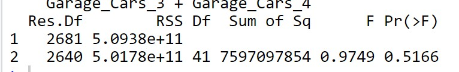

```{r include=FALSE}
source("./scripts/script.R")
source("./scripts/figure_generator.R")
```

# Research Question

-   Primary \| Description

-   Secondary \| Prediction

## Primary \| Description

-   Identify **fixed characteristics** of a property in estimating the housing prices in Ames, Iowa.

-   What improvements can be suggested to increase residential property values ?

## Secondary \| Prediction

Predict the **sale price** of a residential house in Ames, Iowa, based on **fixed, characteristics** of the property.

# Ames Housing Dataset {.build}

-   Sales of individual residential properties in Ames, Iowa from 2006 to 2010.

-   By Sean De Cock (2011), Truman University

-   Well-known for retrospective research in Economics

-   Usually used for Regression - Hedonic Regression

-   A modern alternative to Boston Housing Dataset and California Housing Dataset

## Data Structure

-   `Ames Housing`

-   2930 - 168 = 2762 observations

-   81 features: 23 nominal categorical, 23 ordinal categorical, 15 discrete numeric, and 20 continuous numeric.

-   Response: `Sale_Price`

## 

```{r, echo=FALSE}
property_type_summary %>% kable(caption = "","simple")
```

# Exploratory Data Analysis \| Part 1

-   Missingness

-   Response

## Missingness

```{r missingness, echo=FALSE}
ames_original %>% plot_missing(ggtheme = theme_tq())
```

## Summary Statistics \| Response

```{r message=FALSE, echo=FALSE}
stack_plot_response
```

## 

| Statistics     | Values      |
|----------------|-------------|
| Mean           | \$179,957.7 |
| Median         | \$159,000   |
| Standard Error | 80,219      |

: Sale_Price Statistics

## Transformation on the Response

```{r echo=FALSE}
stack_plot_transformed_response
```

## Update Data Structure

```{r echo=FALSE}
summary(skim(ames1))
```

# Exploratory Data Analysis \| Part 2

-   Distribution of Numericals

-   Correlation Check

-   VIF

## Distribution of Numeric Features

```{r message=FALSE, echo=FALSE}
numeric_plot
```

## 

```{r echo=FALSE}
zero_numeric
```

Remove 10 numeric predictors

## Correlation Check \| Numeric Predictors

```{r numeric-correlation, echo=FALSE, warning=FALSE}
ggplotly(gz, tooltip="text")
```

## Multicollinearity

```{r echo=FALSE}
vif_summary
```

## VIF

```{r echo=FALSE}
vif_score
```

## 

```{r echo=FALSE}
summary(skim(ames3))
```

# Exploratory Data Analysis \| Part 3

-   Removable Categorical Variables

-   Distribution of Categorical Variables

-   Feature Engineering & Dummification

## Categorical Predictors

+---------------+-----------------------------------+------------------------------------------------------+
| Variable Name | Description                       | Reason for Removal                                   |
+===============+===================================+======================================================+
| `Longitude`   | Geographic coordinate - Longitude | Have 2776 levels.                                    |
|               |                                   |                                                      |
|               |                                   | May not be of interests for the buyer or the seller. |
|               |                                   |                                                      |
|               |                                   | Affect computation time.                             |
|               |                                   |                                                      |
|               |                                   | Not appropriate for linear approach.                 |
+---------------+-----------------------------------+------------------------------------------------------+
| `Latitude`    | Geographic coordinate - Latitude  | Have 2762 levels.                                    |
|               |                                   |                                                      |
|               |                                   | May not be of interests for the buyer or the seller. |
|               |                                   |                                                      |
|               |                                   | Affect computation time.                             |
|               |                                   |                                                      |
|               |                                   | Not appropriate for linear approach.                 |
+---------------+-----------------------------------+------------------------------------------------------+

: Removed Categoricals

## Removable Categoricals

```{r echo=FALSE}
stack_plot_rm
```

## 

```{r echo=FALSE}
all_cat$page_1
```

## 

```{r echo=FALSE}
all_cat$page_2
```

## 

```{r echo=FALSE}
all_cat$page_3
```

## 

```{r echo=FALSE}
all_cat$page_4
```

## 

```{r echo=FALSE}
all_cat$page_5
```

## Feature Engineering

-   `Total_Area`

-   `Price_Total_Per_Ft`

-   `Price_Liv_Per_Ft`

-   `Remodeled`

```{r eval=FALSE}
ames6 <- ames5 %>% mutate(
  Total_Area <- Gr_Liv_Area + Total_Bsmt_SF,
  Price_Total_Per_Ft <- Sale_Price / Total_Area,
  Price_Liv_Per_Ft <- Sale_Price / Gr_Liv_Area,
  Remodeled <- ifelse(Year_Remod_Add > Year_Built > 0,1,0)
)
```

## Dummification

```{r eval=FALSE}
for(level in unique(ames6$MS_Zoning)){
  ames6[paste("MS_Zoning", level, sep = "_")] <- ifelse(ames6$MS_Zoning == level, 1, 0)
}

for(level in unique(ames6$Lot_Shape)){
  ames6[paste("Lot_Shape", level, sep = "_")] <- ifelse(ames6$Lot_Shape == level, 1, 0)
}

for(level in unique(ames6$Lot_Config)){
  ames6[paste("Lot_Config", level, sep = "_")] <- ifelse(ames6$Lot_Config == level, 1, 0)
}

for(level in unique(ames6$Neighborhood)){
  ames6[paste("Neighborhood", level, sep = "_")] <- ifelse(ames6$Neighborhood == level, 1, 0)
}

for(level in unique(ames6$Sale_Type)){
  ames6[paste("Sale_Type", level, sep = "_")] <- ifelse(ames6$Sale_Type == level, 1, 0)
}

for(level in unique(ames6$Sale_Condition)){
  ames6[paste("Sale_Condition", level, sep = "_")] <- ifelse(ames6$Sale_Condition == level, 1, 0)}
```

## Update Data Structure

```{r echo=FALSE}
summary(skim(ames7))
```

# Model Selection

-   Forward

-   Backward

-   Stepwise

## Foward \| Backward \| Hybrid

```{r eval=FALSE}
n <- nrow(ames7)
null_mod <- lm(Sale_Price ~ 1, data = ames7)
full_mod <- lm(Sale_Price ~., data = ames7)

## forward selection
foward_aic <- step(null_mod, scope=list(lower=null_mod, upper=full_mod), direction="forward", trace=0); 
foward_bic <- step(null_mod, scope=list(lower=null_mod, upper=full_mod), direction="forward", k=log(n),trace=0); 
anova(foward_bic, foward_aic) # prefer aic

## backward 
back_aic <- step(full_mod, direction="backward",trace=0);
back_bic <- step(full_mod, direction="backward", k=log(n),trace=0);
anova(back_bic,back_aic) #prefer aic

## stepwise 
step_aic <- step(null_mod, scope = list(lower = null_mod, upper=full_mod), trace = 0);
step_bic <- step(null_mod, scope = list(lower = null_mod, upper=full_mod),k=log(n),trace=0)
anova(step_bic,step_aic) #prefer aic

## foward vs. 
anova(foward_aic,back_aic) #prefer foward
anova(step_aic,foward_aic) #prefer step

## backward vs. 
anova(step_aic,back_aic) #prefer back
anova(foward_aic,back_aic) #prefer step 
```

## ANOVA results

**Foward**


**Backward**


**Stepwise**


## 

**Foward vs.**

Backward



Stepwise


## AIC/BIC Selected Model

```{r eval=FALSE}
my_precious <- step_aic_log
my_precious <- readRDS(file = "my_precious.rds")
```

```{r}
length(my_precious$coefficients)
```

## 

```{r}
model_equation(my_precious)
```

# Diagnostic

-   Diagnostic Plots

-   Outliers

## Diagnostic Plots

```{r meassage=FALSE, echo=FALSE, warining = FALSE}
plot(my_precious ,1)
```

## Normal Q-Q Plot

```{r meassage=FALSE, echo=FALSE, warining = FALSE}
plot(my_precious,2)
```

## Cook's Distance

```{r meassage=FALSE, echo=FALSE, warining = FALSE}
plot(my_precious,which=4)
```

## Influential Points

-   1667th, 1405th, 2047th, 2119th

```{r}
which(ames7$Gr_Liv_Area > 4000)
which(abs(rstandard(my_precious))> 3)
```

## 

```{r echo=FALSE}
sale_vs_GrLivArea %+% ames7
```

## 

```{r eval=FALSE}
ames8 <- ames7[-c(1405,2047,2119),]
```

```{r echo=FALSE}
sale_vs_GrLivArea %+% ames8
```

## Transformation

```{r }
par(mfrow = c(1,2))
fit <- update(my_precious, log(Sale_Price) ~., ames8)
plot(fit, c(1,2))
```

## Summary

```{r}
summary(fit)
```

## Remove Insignificant

```{r eval=FALSE}
mlr_final <- update(fit,
  .~ .-Fireplaces_3-Kitchen_Qual_Excellent-Neighborhood_Stone_Brook-Neighborhood_Northridge_Heights
  -Bsmt_Exposure_Gd-House_Style_SLvl-Overall_Cond_Very_Good-Exterior_2nd_ImStucc-Overall_Cond_Good
  -Lot_Config_Corner-BsmtFin_Type_1_ALQ-Neighborhood_Sawyer_West-Neighborhood_Bloomington_Heights
  -Bldg_Type_Twnhs-Lot_Config_CulDSac-BsmtFin_Type_2_Rec-Garage_Cars_4-Foundation_Stone-Neighborhood_South_and_West_of_Iowa_State_University 
  -Garage_Type_More_Than_Two_Types-Exterior_1st_Stucco-TotRms_AbvGrd_9-Sale_Type_Oth-Bsmt_Exposure_Av-Lot_Frontage  -Lot_Shape_Slightly_Irregular-Exter_Cond_Typical,data=ames8)
```

```{r}
length(mlr_final$coefficients)
```

## ANOVA

```{r}
anova(mlr_final, mlr)
```

## Compare $R^2$

```{r}
summary(mlr_final)$adj.r
summary(mlr)$adj.r
```

## Transformation

### Response

```{r echo=FALSE}
powerTransform(mlr_final) %>% summary()
```

### Predictor

```{r echo=FALSE}
powerTransform(cbind(Total_Area + Price_Total_Per_Ft + 
    TotRms_AbvGrd_15 + Bsmt_Qual_Excellent + BsmtFin_Type_2_No_Basement + 
    Garage_Cars_3 + Neighborhood_Northridge + TotRms_AbvGrd_12 + 
    Fireplaces_2 + Overall_Qual_Very_Excellent + Overall_Qual_Excellent + 
    Full_Bath_3 + TotRms_AbvGrd_2 + Lot_Shape_Irregular + Half_Bath_1 + 
    Price_Liv_Per_Ft + Total_Bsmt_SF + House_Style_SFoyer + Bldg_Type_TwnhsE + 
    Bedroom_AbvGr_8 + Garage_Area + Overall_Qual_Average + TotRms_AbvGrd_4 + 
    TotRms_AbvGrd_3 + MS_Zoning_Residential_Low_Density + Bedroom_AbvGr_5 + 
    Year_Remod_Add + TotRms_AbvGrd_5 + Neighborhood_Meadow_Village + 
    Overall_Qual_Poor + Bsmt_Qual_Fair + Exter_Cond_Fair + TotRms_AbvGrd_11 + 
    Overall_Qual_Fair + Remodeled + Mas_Vnr_Area + Full_Bath_1 + 
    House_Style_One_and_Half_Fin + Overall_Qual_Below_Average + 
    Neighborhood_Green_Hills + Sale_Condition_Abnorml + Neighborhood_Northpark_Villa + 
    Overall_Cond_Fair + Bedroom_AbvGr_3 + TotRms_AbvGrd_7 + Mas_Vnr_Type_None + 
    Neighborhood_Briardale + Roof_Style_Flat + Full_Bath_4 + 
    Exterior_1st_ImStucc +1 ) ~1, data=ames8) %>% summary()
```

## Final Diagnostic

```{r}
par(mfrow = c(2,2))
plot(mlr,c(1,2,3))
```

## Author's Words


## Regularization

[***UC Business Analytics R Programming Guide***](https://uc-r.github.io/ "Home")

```{r eval=FALSE}
ames_ridge <- cv.glmnet(
  x = ames_x,
  y = ames_y,
  alpha = 0
)
```

```{r echo=FALSE}
plot(ames_ridge)
```

## 

```{r}
ridge_result
```

## Lasso

10-fold cross validation

```{r eval=FALSE}
ames_lasso <- cv.glmnet(
  x = ames_x,
  y = ames_y,
  alpha = 1
)
```

```{r}
plot(ames_lasso)
```

$-7 \le \log(\lambda) \le -5$

$\lambda$ value with the minimum MSE and the largest $\lambda$ value within one standard error of the minimum MSE.

## 

```{r message=FALSE}
lasso_result
```

## Comparison

```{r}
min(ames_ridge$cvm)
min(ames_lasso$cvm)
```

## 

```{r message=FALSE, warning=FALSE}
ames_lasso %>% coef() %>% tidy()
```

# Train & Evaluate

```{r eval=FALSE}
library(tidymodels)

## set em seeds
set.seed(666)
## 80/20 
ames_split <- initial_split(ames9, prop = 0.80)
ames_train <- training(ames_split)
ames_test  <-  testing(ames_split)

mlr_recipe <- recipe(Sale_Price ~ Total_Area + Price_Total_Per_Ft + 
                       TotRms_AbvGrd_15 + Bsmt_Qual_Excellent + BsmtFin_Type_2_No_Basement + 
                       Garage_Cars_3 + Neighborhood_Northridge + TotRms_AbvGrd_12 + 
                       Fireplaces_2 + Overall_Qual_Very_Excellent + Overall_Qual_Excellent + 
                       Full_Bath_3 + TotRms_AbvGrd_2 + Lot_Shape_Irregular + Half_Bath_1 + 
                       Price_Liv_Per_Ft + Total_Bsmt_SF + House_Style_SFoyer + Bldg_Type_TwnhsE + 
                       Bedroom_AbvGr_8 + Garage_Area + Overall_Qual_Average + TotRms_AbvGrd_4 + 
                       TotRms_AbvGrd_3 + MS_Zoning_Residential_Low_Density + Bedroom_AbvGr_5 + 
                       Year_Remod_Add + TotRms_AbvGrd_5 + Neighborhood_Meadow_Village + 
                       Overall_Qual_Poor + Bsmt_Qual_Fair + Exter_Cond_Fair + TotRms_AbvGrd_11 + 
                       Overall_Qual_Fair + Remodeled + Mas_Vnr_Area + Full_Bath_1 + 
                       House_Style_One_and_Half_Fin + Overall_Qual_Below_Average + 
                       Neighborhood_Green_Hills + Sale_Condition_Abnorml + Neighborhood_Northpark_Villa + 
                       Overall_Cond_Fair + Bedroom_AbvGr_3 + TotRms_AbvGrd_7 + Mas_Vnr_Type_None + 
                       Neighborhood_Briardale + Roof_Style_Flat + Full_Bath_4 + 
                       Exterior_1st_ImStucc+Gr_Liv_Area, data=ames_train) %>% 
  step_log(Gr_Liv_Area, base = 10)

lm_model <- linear_reg() %>% set_engine("lm")

## Work flow 
lm_wflow <- 
  workflow() %>% 
  add_model(lm_model) %>% 
  add_recipe(mlr_recipe)


## fit on training 
lm_fit <- fit(lm_wflow, ames_train)

## Prediction 
lm_test_res <- predict(lm_fit, new_data = ames_test %>% select(-Sale_Price))
lm_test_res <- bind_cols(lm_test_res, ames_test %>% select(Sale_Price))
```

## RMSE Comparison

MLR RMSE result

```{r echo=FALSE}
ames_metrics <- metric_set(rmse, rsq, mae)
ames_metrics(lm_test_res, truth = Sale_Price, estimate = .pred)

```

Lasso RMSE result

```{r}
min(ames_lasso$cvm)
```

## `lm()` with Lasso Coefficents

```{r}
lasso_fit <- lm(Sale_Price ~ Year_Built+Year_Remod_Add+Gr_Liv_Area+Garage_Area+Total_Area+Price_Total_Per_Ft+Price_Liv_Per_Ft+MS_Zoning_Residential_Low_Density+MS_Zoning_Residential_Medium_Density+
                         Exter_Qual_Good+Exter_Cond_Fair+Bsmt_Qual_Good+Bsmt_Qual_No_Basement+BsmtFin_Type_2_No_Basement+Heating_QC_Excellent+Kitchen_Qual_Good+
                         Garage_Type_Attchd+Garage_Type_No_Garage+Sale_Condition_Abnorml+Overall_Qual_Good+Overall_Qual_Below_Average+Overall_Qual_Fair+Overall_Qual_Poor+
                         Overall_Qual_Very_Excellent+Overall_Cond_Poor+Overall_Cond_Fair+Overall_Cond_Very_Poor+Full_Bath_1+Full_Bath_2+Half_Bath_0+Half_Bath_1+Bedroom_AbvGr_2+
                         TotRms_AbvGrd_7+TotRms_AbvGrd_5+TotRms_AbvGrd_4+TotRms_AbvGrd_12+TotRms_AbvGrd_3+TotRms_AbvGrd_2+TotRms_AbvGrd_15+Fireplaces_0+Garage_Cars_2+Garage_Cars_1, data=ames9)

length(lasso_fit$coefficients)
```

## Diagnostic ?

```{r}
par(mfrow=c(1,2))
plot(lasso_fit, c(1,2))
```

# Boruta Result

Still waiting ?

# Discussion

-   Regression: GLM, Random Forest

-   Clustering

<!-- -->

-   CART for interpretation and transformation for the predictors

-   PCA

-   Rescaling systematically

-   JUST DROP THEM
